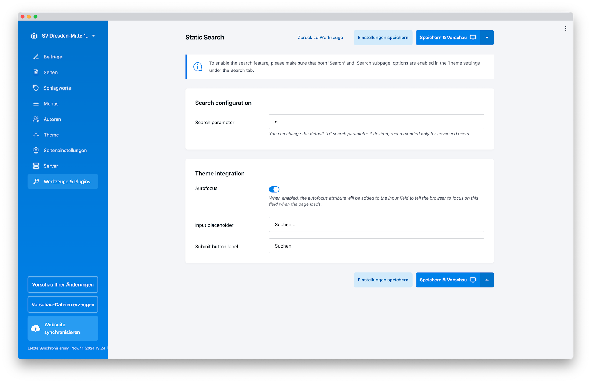

# Static Search
Static Search is a plugin for Publii, a static site generator. With this plugin, site owners can easily add a static search functionality to their website, without the need for a dynamic search engine. By leveraging the JSON and javascript, Static Search offers a fast and reliable search experience for users.

# Installation
1. Download the plugin from the GitHub repository.
2. In Publii, go to "Plugins" > "Add new" and select the downloaded ZIP file. OR Unzip the downloaded file. Copy the "static-search" folder to your Publii's "plugins" directory.
3. Activate the plugin.
4. Go to the "Plugins" section in the Publii app and enable the "Static Custom Search" plugin..

# Usage
To use Static Search, enable the search feature in your site's theme settings under the Search tab, and you're ready to go!

1. After installing and enabling the plugin, go to the "Settings" section in the Publii app and click on "Static Search".
2. Customize the search bar settings according to your preferences, including the search bar's position, placeholder text, and button text.
3. Save your changes.
4. Publish your website.
5. The search bar should now be visible on your website, allowing your users to search your website's content.

# Support
If you encounter any issues or have any questions, please feel free to open an issue in this repository.

# License
This plugin is released under the MIT license.
